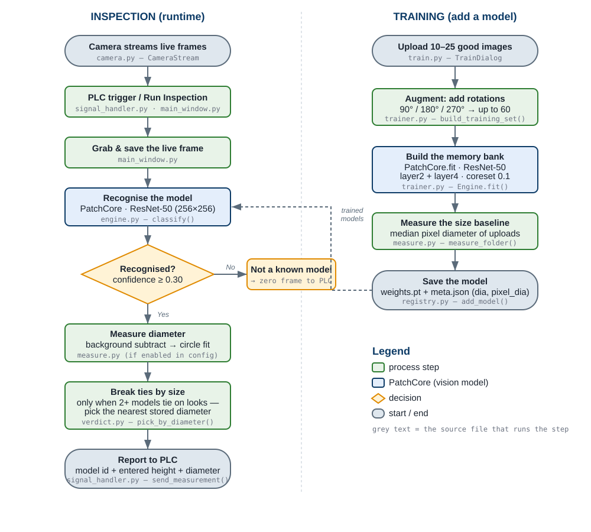

<!--
  SOURCE OF TRUTH. Edit THIS file, then run:  python docs/build_docs.py
  That regenerates PROJECT_DOCUMENTATION.html from this markdown.
  Do not edit the .html by hand — your changes will be overwritten.
-->

# Wheel Inspection System — Project Documentation

A desktop application that looks at a wheel component on a conveyor through an
overhead camera and **recognises which model it is**. When two trained models
share the **same pattern but differ in size**, the app **measures the
component's diameter** to decide which one it is. When a PLC sends a trigger
over the serial line, the app grabs the live frame, runs recognition, and
reports the result back to the PLC.

This document explains, in plain language, how every part works and why each
method was chosen.

---

## 1. What the system does (in one picture)

```
        ┌──────────────┐      HTTP video       ┌───────────────────────────┐
        │  IP Camera   │ ────── stream ──────► │   Wheel Inspection App    │
        │ (overhead)   │                       │   (this software)         │
        └──────────────┘                       └────────────┬──────────────┘
                                                             │
        ┌──────────────┐   serial trigger (COM)             │  serial reply
        │     PLC      │ ─────────────────────────────────► │  (13-byte frame:
        │  (machine)   │ ◄───────────────────────────────── │   model + size)
        └──────────────┘                                     │
                                                             ▼
                                           recognise model  +  measure diameter
```

The app is **recognition-only**: it decides *which* model a wheel is. It does
not grade quality (no OK/NG). Diameter measurement is used to separate two
models that look identical but differ in size — see §8.

### Screenshots

.png)


### System & training flowchart

Every block is labelled with the source file that runs it.



---

## 2. Key facts at a glance

| Item | Value | Note |
|---|---|---|
| Camera stream | HTTP MJPEG, 1280×720 (720p HD) | one overhead camera |
| Classification input | 256×256, ImageNet-normalised | downsized for speed |
| Measurement input | full 1280×720 frame | needs the detail |
| Recognition model | PatchCore (anomalib), ResNet-50 backbone | layers layer2 + layer4 |
| Training images | 10–25 uploads → rotated up to 60 | per model |
| Recognition gate | confidence ≥ 0.30 | else "not a known model" |
| Pixel scale | 0.885 mm per pixel | rig calibration |
| Mask threshold | 75 (fixed) | from a threshold sweep |
| Diameter tolerance | 3% | for the size tie-break |
| Measured accuracy | ≈ ±4 mm typical (±15 mm worst) | limits size discrimination |

---

## 3. Software dependencies

Runs on **Python 3.10** inside a conda environment (`depth` on the production
machine, `dl` on the dev machine). Versions below are the tested ones.

| Package | Version | Used for | Required? |
|---|---|---|---|
| PySide6 | 6.11 | The desktop UI and threading (Qt) | Yes |
| torch | 2.12 (CPU) | Runs the ResNet-50 feature extractor | Yes |
| torchvision | 0.27 | Image transforms for the model | Yes |
| anomalib | 2.5 | Provides the PatchCore model | Yes (for recognition) |
| timm | 1.0 | Supplies the ResNet-50 backbone | Yes |
| kornia | 0.8 | Image ops used inside anomalib | Yes |
| lightning | 2.6 | Training engine anomalib runs on | Yes (for training) |
| opencv (cv2) | 4.13 | Camera stream + diameter measurement | Optional* |
| numpy | 2.2 | Array math everywhere | Yes |
| pyserial | 3.5+ | Serial trigger + PLC reply frame | Optional* |
| pillow (PIL) | 12 | Image loading/saving | Yes |

*Optional means the app still starts without it — the camera/measurement or the
serial trigger simply stays off, and the UI says so. This lets the app run on a
bench machine that has no camera or PLC attached.

Install (into the conda env) with `pip install -r requirements.txt`. On the
production machine these are already present in the `depth` env.

---

## 4. File structure and how the files link together

```
wheel_inspection_py/
├── main.py                     entry point → opens MainWindow
├── settings.json               camera URL, COM port, recognition gate, scale…
├── measure_config.json         diameter fit method + threshold method
├── users.json                  operator/developer accounts (hashed passwords)
├── history.db                  SQLite log of every inspection
├── WheelInspection.bat         double-click launcher (activates conda env)
├── requirements.txt
├── models/                     one folder per trained model
│   └── <name>/
│       ├── weights.pt          the PatchCore memory bank
│       └── meta.json           name, diameter, height, pixel_diameter
├── Assets/                     logo + reference scripts
├── docs/                       this documentation + build script + work log
└── app/
    ├── core/                   data + storage + business rules (no UI)
    │   ├── models.py           plain data classes (ModelData, AppSettings…)
    │   ├── config.py           read/write settings.json
    │   ├── paths.py            frozen-aware root paths (works as .exe too)
    │   ├── registry.py         the models/ folder store
    │   ├── state.py            AppState — holds settings + models, Qt signals
    │   ├── auth.py             users.json login
    │   ├── history.py          history.db read/write
    │   └── verdict.py          recognition math + the diameter tie-break
    ├── inference/              the machine-vision work
    │   ├── engine.py           InferenceEngine — loads models, classify()
    │   ├── trainer.py          TrainThread — trains a new model
    │   └── measure.py          diameter: mask → circle fit
    ├── comms/                  the outside world
    │   ├── camera.py           CameraStream — reads the HTTP video
    │   └── signal_handler.py   serial trigger in, PLC frame out
    └── ui/                     everything visible
        ├── main_window.py      the orchestrator (wires it all together)
        ├── theme.py, widgets.py, dashboard.py
        └── dialogs/            Train, Batch run, Background, Mask view,
                                Model data, Modbus, Users, Login, Activity log
```

**How they link (who calls whom):**

```
                         main.py
                            │ creates
                            ▼
                    ui/main_window.py  ── the hub ──────────────────┐
                       │       │      │        │            │        │
             owns      │  owns │ owns │  opens │   reads    │  uses  │
                       ▼       ▼      ▼        ▼            ▼        ▼
        inference/engine  comms/    comms/   ui/dialogs/  core/state  core/verdict
         (classify)      camera   signal_    (Train,      (settings + (winner +
             │          (video)   handler     Batch,       models)     tie-break)
             │                    (PLC)       Background…)
             ▼
        core/registry ──► models/<name>/weights.pt + meta.json
             ▲
             │ writes
        inference/trainer ──► inference/measure (measures pixel_diameter)
```

Rules of thumb:
- **`core/`** knows nothing about the UI or Qt widgets — it is pure data and
  logic, so it can be tested and reused.
- **`main_window.py`** is the only place that connects the pieces (engine +
  camera + serial + dialogs). Everything flows through it.
- **`state.py`** is the shared truth: current settings and the model list. It
  emits Qt signals when they change so the UI refreshes.

---

## 5. System architecture — PySide6 (Qt) threading

The UI must never freeze. Anything slow or blocking runs on its **own background
thread** and talks to the UI only by **emitting Qt signals** — Qt delivers those
to the main thread safely. Background threads never touch a widget directly.

```
   ┌─────────────────────────── MAIN (GUI) THREAD ───────────────────────────┐
   │  Qt event loop · all widgets · classification · measurement             │
   │                                                                         │
   │   receives signals ▲        ▲          ▲              ▲                  │
   └────────────────────┼────────┼──────────┼──────────────┼─────────────────┘
                        │        │          │              │
      frame_ready(QImage)│  triggered()│  progress/done() │  ready(names)
                        │        │          │              │
   ┌────────────────┐ ┌─┴──────────────┐ ┌─┴───────────┐ ┌─┴──────────────┐
   │ CameraStream   │ │ _DetectThread  │ │ TrainThread │ │ _Warmer        │
   │ (QThread)      │ │ (QThread)      │ │ (QThread)   │ │ (QThread)      │
   │ reads MJPEG    │ │ polls the      │ │ trains one  │ │ pre-loads      │
   │ video frames   │ │ serial port    │ │ new model   │ │ models at start│
   └────────────────┘ └────────────────┘ └─────────────┘ └────────────────┘
```

| Thread | Job | Signal it emits |
|---|---|---|
| Main (GUI) | UI, classify, measure, decide, reply to PLC | — |
| `CameraStream` | Read the HTTP video continuously | `frame_ready(QImage)` |
| `_DetectThread` (in `SignalHandler`) | Watch the serial port for a PLC trigger | `triggered()` |
| `TrainThread` | Train a model in the background | `progress`, `done`, `failed` |
| `_Warmer` | Load models into memory at startup | `ready(names)` |

**Why classification runs on the main thread:** it is CPU work of ~0.1–1 s. It
is launched with `QTimer.singleShot(0, …)` so the UI repaints *first* (showing
"Classifying…"), then the work runs. Heavy *and* long tasks (training, camera)
get real threads; short ones are deferred instead.

---

## 6. Data flow — one full inspection

```
  ① Camera continuously streams frames
        CameraStream(thread) ──frame_ready──► main thread stores _latest_qimage
                                                       (Live Feed shows it)

  ② PLC sends a trigger on the serial line
        _DetectThread(thread) ──triggered──► main thread

  ③ Main thread saves the newest frame to disk (the inspection input)

  ④ engine.classify(frame)
        resize 256×256 → ResNet-50 → compare to every model's memory bank
        → per-model score + confidence → winner, matched?

  ⑤ (if enabled) measure.measure(frame)
        background subtract → mask → circle → diameter (px, mm)

  ⑥ verdict.pick_by_diameter(...)   ← only if two models tie on appearance
        choose the model whose stored size is nearest the measurement

  ⑦ Results fan out:
        → UI            (Predicted Model, Status, Diameter row)
        → history.db    (audit log; dashboard counts refresh)
        → signal_handler.send_measurement()  ──► PLC  (13-byte frame:
                                                         model id + ENTERED
                                                         height + ENTERED diameter)
```

> **Which diameter goes to the PLC?** The **entered** diameter (typed at training,
> stored in `meta.json`), not the measured one. The measured value is used only
> to *choose* the model in step ⑥; the clean nominal spec is what is transmitted.

---

## 7. Recognition — how the app knows the model (PatchCore)

### 7.1 The idea in plain words

Normal image classifiers need thousands of labelled examples per class. We do
**not** have that, and we add new wheel models often. So we use **PatchCore**,
an *anomaly-detection* method used here for recognition:

1. In training, each model's good images pass through a frozen **ResNet-50**
   feature extractor. The resulting "patch features" are stored in a compressed
   **memory bank** — a fingerprint of what that model looks like.
2. At inspection, the captured frame's patches are compared to every model's
   memory bank. The **closer** the match, the higher that model's confidence.
3. The **highest-confidence** model wins. If even the best is below the **0.30
   gate**, the part is *"not a known model"* (novelty rejection).

**Why PatchCore:** only ~20 good images per model, trains in minutes on a CPU
(no GPU), needs no defect labels, and adding a model is just one more memory
bank — nothing else is disturbed.

**Why ResNet-50, layers layer2 + layer4:** these two layers mix *mid-level*
texture (spoke edges) with *high-level* shape. That combination tolerates the
wheel sitting at different rotations and positions, which was the single biggest
cause of early misrecognition.

### 7.2 PatchCore pipeline — training vs inference

```
   ── TRAINING (build the fingerprint) ────────────────────────────────
   good images ─► ResNet-50 (layer2, layer4) ─► patch feature vectors
                                                       │
                                       coreset subsample (keep 10%)
                                                       │
                                                       ▼
                                              MEMORY BANK  ──► weights.pt

   ── INFERENCE (recognise) ───────────────────────────────────────────
   one frame ─► ResNet-50 (layer2, layer4) ─► patch feature vectors
                                                       │
                       for each patch: distance to the NEAREST bank vector
                                                       │
                                    the largest distance = anomaly score
                                                       │
                          confidence = 1 − (score − min)/(max − min)
                                                       │
                             winner = model with the highest confidence
```

- **Coreset subsample:** the memory bank would be huge, so PatchCore keeps a
  representative **10%** of the patch features (the "coreset ratio"). Higher kept
  nothing useful here but made models 5× bigger and slower.
- **Nearest-neighbour distance** is why it recognises: a frame of Model A lands
  close to Model A's bank (small distance, high confidence) and far from the
  others.

### 7.3 Training a model (operator's view)

```
   Upload 10–25 good images of ONE model
        │  augment: + 90°/180°/270° rotations, up to 60 total
        ▼
   PatchCore.fit  (ResNet-50 layer2+layer4, coreset 0.1)
        · validation = a copy of the uploads (nothing held out)
        · calibration widened: image_max = 2 × image_min
        ▼
   Save models/<name>/weights.pt + meta.json (diameter, height, pixel_diameter)
```

Each choice fixed a real failure — see §14 (progress table) for the story.

---

## 8. Diameter measurement — how the app measures size

Two wheel models can share a pattern but differ in diameter. PatchCore compares
*appearance*, so it can confuse them. Measuring the physical diameter gives a
second, independent signal to break that tie.

### 8.1 Preprocessing pipeline (step by step)

Runs on the **full 1280×720** frame (not the 256×256 used for recognition —
measuring size needs the resolution).

```
 1. Background subtraction   absdiff(frame, empty-conveyor reference)
                             Removes the fixed rig (rollers, rails, shadows).
                             Needs a photo of the EMPTY conveyor; without one it
                             falls back to plain thresholding and logs "NO".
 2. Grayscale                convert to one channel
 3. Blur                     Gaussian 5×5 — calm sensor noise
 4. Threshold                grey → black/white mask.
                             Fixed cut = 75 (see §8.3), or Otsu if configured.
 5. Morphology OPEN  (5px)   erase tiny white specks
 6. Morphology CLOSE (9px×2) seal small gaps in the outline
 7. Find contours            outline every white region
 8. Fragment filter          drop fragments < 2% of the biggest (far-away specks,
                             e.g. the timestamp text)
 9. Convex hull              wrap the kept fragments in one outline; also fills
                             the spoke holes → a solid disc
10. Edge reject              if the outline touches the frame border the part is
                             cut off → refuse (would read too small)
11. Min enclosing circle     smallest circle containing the outline → diameter (px)
12. Pixels → millimetres     diameter_px × 0.885
```

Debug window: **green** = the outline measured (step 9), **red** = the fitted
circle (step 11); a `roundness` number warns when the outline is not a clean disc.

### 8.2 Why each measurement method

- **Background subtraction** (not thresholding alone): the rig has bright rollers
  a plain threshold would include. Subtracting a fixed reference isolates the
  wheel. (Without it, one wheel measured 1193 px instead of 557 px.)
- **Convex hull + min-enclosing circle:** a wheel's mask breaks into arcs (spoke
  gaps, roller overlaps). Fitting the circle to the *convex hull of the
  fragments* rebuilds the full rim from those arcs.
- **The 2% fragment filter:** distant specks (timestamp text) were stretching the
  circle and inflating the diameter (569 mm vs a 496 mm part). Dropping small
  fragments first fixes it.

### 8.3 Why threshold 75

A sweep on real captures: below ~60 the mask leaks and inflates; above ~90 it
clips the dim rim. **75–80 is a stable plateau** where a known 491 mm wheel read
492.7 mm (+0.3%). We fix it at 75 — one threshold for every part.

### 8.4 The size tie-break and its accuracy limit

The tie-break runs only when two models both pass the gate and both have a
stored size; it picks the nearest, or abstains if none is within 3%. It **never
overrides** recognition on its own.

Measuring the same wheel repeatedly gives a **range** — about **±4 mm** typical,
up to **±10–15 mm** in bad frames. Two models can be separated by diameter only
if they differ by **more than ~30 mm**. Models closer than that (e.g. 5 mm apart)
**cannot** be split by diameter on this camera — recognition, or a hardware
gauge, must handle them.

---

## 9. Image resolution — what we feed the software and why

| Stage | Resolution | Why |
|---|---|---|
| Camera capture | 1280×720 (720p) | Enough detail for both jobs at reasonable HTTP bandwidth. At 0.885 mm/px a 490 mm wheel is ≈ 553 px across — fits the 1280-wide frame with margin. |
| Recognition | 256×256 | ResNet-50's expected input. Pattern recognition doesn't need full resolution, and the smaller image keeps CPU inference fast. |
| Measurement | 1280×720 (full) | Size accuracy needs every pixel; downscaling would coarsen the diameter. |

---

## 10. Camera stream URL & troubleshooting

The camera is an **IP camera** serving an **HTTP MJPEG** stream. The one setting
that matters is its **stream URL**, in `settings.json` under `http_streamer.url`
(e.g. `http://192.168.100.50:8080/stream-hd`), with a `timeout` in seconds.

> **Caution — the URL must be correct and reachable.** The camera needs a fixed
> IP on the same network as the PC, and the URL must be its exact MJPEG stream
> path. On start the app does a quick reachability check, opens the stream, and
> auto-retries every 5 s if the camera is not ready. If the URL or IP is wrong,
> the Live Feed stays blank and a PLC trigger reports "no live frame".

**Troubleshooting:**

| Symptom | Likely cause |
|---|---|
| "Camera not connected" | Wrong IP, camera off, or not on the LAN — the reachability check failed |
| Connects but "stream ended/unreachable" | Reachable host but wrong URL path, or a stream format the backend can't read |
| Live Feed frozen then "reconnecting…" | Network drop; the app retries automatically |

---

## 11. Precautions for good results (machine environment)

The vision is only as good as the conditions. On a real line, hold these steady:

- **Lighting — the biggest factor.** Use constant, diffuse illumination. Avoid
  changing daylight, flicker, and glare/reflections off the bare metal. If
  lighting changes, both recognition and the mask degrade.
- **Never move the camera.** Its height and angle are fixed into every trained
  model and into the 0.885 mm/px scale. Moving it means retraining everything and
  re-deriving the scale.
- **Match training to production.** Train each model through the **same camera,
  framing, and lighting** the line uses. A domain gap (different source) is the
  classic cause of "good part not recognised".
- **Keep the background reference current.** Re-capture the empty-conveyor
  reference (Options → Background reference) after any lighting, camera, or rig
  change — a stale reference is the #1 cause of bad masks.
- **Present parts fully in frame.** A wheel cut off at the frame edge is refused
  by measurement ("touches frame edge") and reads wrong.
- **Good, varied training images.** Known-good parts only, spanning the real
  rotations and positions the wheel shows — 20–25 diverse frames beat 100 near-
  identical ones.
- **Keep the threshold fixed** once tuned (75). Re-tune only if lighting changes;
  don't chase individual frames.
- **Keep the lens clean.** Dust or oil film softens edges and fragments the mask.
- **Reliable network + power** for the IP camera and PC, so triggers are never
  missed mid-cycle.
- **After any change, run a Batch test** (Batch run → Export CSV) to confirm
  recognition and measurement still behave before trusting the line.

---

## 12. Deployment & operation

Two ways to run on a machine. **Option A** needs conda; **Option B** is a
self-contained double-click app with no Python required.

### 12.1 Option A — launcher into a conda env (dev / conda machines)

`WheelInspection.bat` activates the conda `depth` env (falls back to `dl`) and
runs `main.py`. Double-click it, or make a desktop shortcut. The source `.py`
files must be present on the machine.

### 12.2 Option B — build the double-click .exe (PyInstaller)

For a machine without Python. Build **on a machine that has the working env**:

```
conda activate depth            # or dl on the dev box
pip install pyinstaller
pyinstaller WheelInspection.spec --noconfirm
```

- **Use the `.spec` file**, not a bare `pyinstaller main.py` — the spec carries
  the `--collect-all` for torch / anomalib / timm / kornia / lightning that a
  naive build misses (the exe would otherwise crash with `ModuleNotFoundError`).
- The spec sets **`console=False`** (no terminal window). All logs then go to
  **`WheelInspection.log`** next to the exe.
- Output: **`dist\WheelInspection\`** — the exe plus an `_internal\` folder
  (torch is large, so expect a multi-GB folder; build takes 10–20 min).

### 12.3 Assemble the release folder

Copy the data files **next to the exe** (the spec deliberately does not bundle
them, so they stay editable and survive upgrades):

```
Copy-Item Assets  dist\WheelInspection\Assets  -Recurse
Copy-Item models  dist\WheelInspection\models  -Recurse
Copy-Item settings.json        dist\WheelInspection\
Copy-Item measure_config.json  dist\WheelInspection\
```

Do **not** copy `users.json` or `history.db` — the app creates those fresh on
the client. Zip `dist\WheelInspection\` — that zip is the release.

### 12.4 Install on the client's machine

1. Unzip to a writable location, e.g. **`C:\WheelInspection\`** — **not**
   `C:\Program Files` (the app writes `history.db`, `settings.json`, logs next
   to the exe and needs write access).
2. Right-click `WheelInspection.exe` → **Send to → Desktop (create shortcut)**.
   That shortcut is the operator's double-click app.
3. First launch: it creates `history.db`, `users.json`, and `WheelInspection.log`
   beside the exe. Edit `settings.json` for the site (camera URL, COM port) and
   relaunch.
4. **Auto-start on power-on (optional):** enable Windows auto-login (`netplwiz`),
   then drop the desktop shortcut into the Startup folder (Win+R →
   `shell:startup`). On boot the app opens and starts listening with no
   operator action.
5. **Upgrades:** replace only `WheelInspection.exe` and `_internal\`. Never
   overwrite `models\`, `settings.json`, `measure_config.json`, `users.json`, or
   `history.db` — that is the site's data.

*(Full build troubleshooting — antivirus, missing modules, Qt plugin errors —
is in `docs/build_windows_exe.md`.)*

### 12.5 Runtime behaviour

- **Auto-start & camera resilience:** on a stream drop the Live Feed shows
  "Camera disconnected — reconnecting…" and retries every 5 s; a trigger during
  an outage reports "no live frame" instead of measuring a stale image.
- **Storage discipline:** heatmap overlays and training scratch are not written
  to disk automatically; the overlay renders in memory only when enabled.
- **Config files:** `settings.json` (camera, COM, gate, scale) and
  `measure_config.json` (measurement controls). Both read live; most changes
  need no restart.

---

## 13. Data storage — the history database

The app keeps its records in a single **SQLite** file, **`history.db`**. SQLite
is used (not a JSON file, not a server) because these records grow one row per
inspection: it gives crash-safe appends, real queries (today's count, count per
model), and it is just a file — `stdlib sqlite3`, no database server to install.

### 13.1 Schema — two tables

**`inspections`** — one row per Run Inspection (feeds the dashboard):

| Column | Type | Meaning |
|---|---|---|
| `id` | INTEGER PRIMARY KEY | auto row id |
| `ts` | TEXT | ISO timestamp of the inspection |
| `model` | TEXT | recognised model name (`''` when not a known model) |
| `diameter` | REAL | mm, as sent to the PLC (the **entered** spec) |
| `height` | REAL | mm, as sent to the PLC |
| `confidence` | REAL | 0..1 recognition confidence |
| `matched` | INTEGER | 1 = recognised, 0 = not a known model |

**`audit_log`** — one row per notable action (accountability; passwords are
never stored):

| Column | Type | Meaning |
|---|---|---|
| `id` | INTEGER PRIMARY KEY | auto row id |
| `ts` | TEXT | when it happened |
| `username` | TEXT | who did it (`''` if not logged in) |
| `action` | TEXT | e.g. `login`, `login_failed`, `train_model`, `delete_model` |
| `details` | TEXT | specifics, e.g. `"model1 -> typeA"` |

The dashboard reads this DB: **Today's count** and **month count** are
`matched = 1` rows filtered by date; **Wheel Count by Model** is a
`GROUP BY model`; **Recent Inspections** is the newest rows. `code:` `history.py`.

### 13.2 How the database is generated

**Automatically — there is nothing to install or set up.** On the very first
run, `history.py` executes `CREATE TABLE IF NOT EXISTS …` and the file appears.
Every inspection then appends a row; every login / train / delete appends an
audit row. No schema migration or admin step is needed.

### 13.3 Placing it on the client's system

1. **Nothing to copy — it self-creates.** `history.db` is written **next to the
   executable** (frozen-aware `ROOT`, see §4), i.e. inside
   `dist\WheelInspection\`. On first launch it is created empty; you do **not**
   ship a database.
2. **Do NOT ship your dev `history.db`** — it holds test rows. Let the client's
   machine start clean.
3. **Permissions:** install the app somewhere the operator account can write
   (e.g. `C:\WheelInspection\`), **not** `C:\Program Files` — the app must be
   able to create/append the DB file.
4. **Backups:** the DB is one file. To back up or archive, just **copy
   `history.db`** while the app is closed (or use SQLite's online backup). To
   reset history, close the app and delete the file — it re-creates empty.
5. **Viewing / reporting:** open `history.db` in any SQLite tool (DB Browser for
   SQLite, `sqlite3` CLR, Python `sqlite3`) to run reports, e.g.
   `SELECT model, COUNT(*) FROM inspections WHERE matched=1 GROUP BY model;`.
6. **Upgrades:** when you replace the exe + `_internal`, **leave `history.db`
   in place** — it lives outside `_internal` precisely so upgrades don't wipe
   the client's records.

---

## 14. Project progress — from day one to now

Each stage solved a concrete problem found by testing. Dates are the working
sessions (2026).

| Date | Stage | What we did | Why | Testing |
|---|---|---|---|---|
| 15 Jul | 1. Training set size | Min images 25 → 10; rotate uploads up to 20, then 60 | Client wanted to shoot only 20–25 photos | Augmentation counts checked (10→40, 25→60) |
| 15 Jul | 2. Epochs | Confirmed `max_epochs` has no effect | PatchCore forces 1 epoch | Read anomalib source; "Overriding max_epochs" log |
| 15 Jul | 3. Coreset ratio | Tried 0.5, settled on 0.1 | 0.5 gave 500 MB models, 5× slower, no accuracy gain | Batch scores unchanged; checkpoints ~5× smaller |
| 16 Jul | 4. Feature layers | layer2+layer3 → layer2+layer4 | Better pose tolerance (Assets recipe) | Batch CSV before/after |
| 16 Jul | 5. Stale-cache bug | Clear the model cache on retrain | Retrains gave byte-identical scores (old weights) | Scores changed after fix |
| 16 Jul | 6. Validation split | Stop holding uploads out of the bank | The held-out ~20% were the images that failed | Failing images passed after retrain |
| 16 Jul | 7. Calibration | Widen `image_max` to 2× `image_min` | All-good validation made every part read 0% | 25/25 genuine parts recognised |
| 16 Jul | 8. Recognition result | **~60% → ~98% correct** | Sum of 4–7 + curated diverse training | Mixed 30-image batch runs |
| 16 Jul | 9. Diagnostics | Export-CSV + per-model scores to terminal | Debug from numbers, not screenshots | Used throughout |
| 16–21 Jul | 10. Deployment | Conda launcher, auto-start, PyInstaller guide | Ship + open on power-on | Launched on dev machine |
| 16 Jul | 11. Storage safety | Stop writing heatmaps / scratch | Would fill the production disk | Confirmed engine writes nothing |
| 20–21 Jul | 12. Diameter feature | Background subtraction + circle fit + config | Separate look-alike models by size | Synthetic circles exact; real captures validated |
| 20 Jul | 13. Calibration check | Validated 0.885 mm/px | Trust the mm numbers | Model 9: 492.7 vs 491 (+0.3%); Model33: 336 vs 332 (+1.3%) |
| 20–21 Jul | 14. Findings | Model 2 spec (496) is ~478–482 real; ±5 mm models can't be split by diameter | Set client expectations | Threshold sweep + bbox + overlay agree |
| 28 Jul | 15. Config & docs | measure_config.json, mask debug window, this documentation | Operator-tunable + maintainable | Config resolves; both fit methods agree |
| 28 Jul | 16. Tie-break rework + operator build | Diameter tie-break made refine-only — used only when 2+ models score ≥ tie_confidence, never rejects/overrides a lone match; all measurement controls moved to measure_config.json (UI checkboxes removed); console-less exe that logs to WheelInspection.log; data (history.db, settings, models) kept beside the exe | Fix "same pattern, different size → both read as smaller"; ship an operator-facing build | Tie-break verified on 4 scenarios; frozen data paths simulated |

---

## 15. Glossary

- **PatchCore** — an anomaly-detection model; here it learns each wheel model's
  "normal" appearance and recognises by best match.
- **Memory bank** — the stored patch features that fingerprint one model.
- **Confidence** — how well the winning model fits, 0..1; must reach 0.30.
- **Mask** — the black/white image where white = the wheel.
- **Convex hull** — the tightest outline wrapping all the white fragments.
- **Min enclosing circle** — the smallest circle containing that outline; its
  size is the measured diameter.
- **pixel_to_mm (0.885)** — millimetres per pixel on this rig.
- **Coreset ratio** — the fraction of patch features kept in the memory bank.
- **QThread / signal** — Qt's background thread and the thread-safe message it
  sends to the UI.
