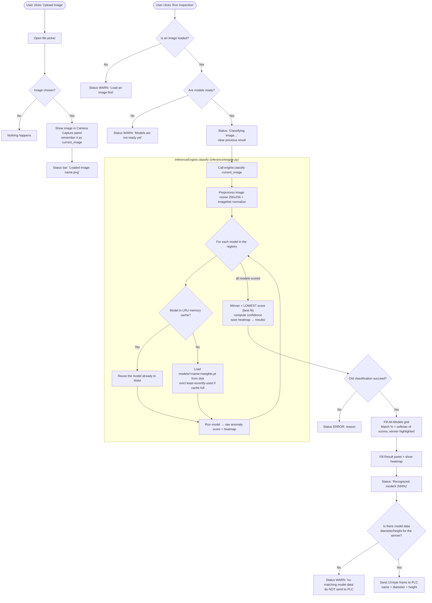
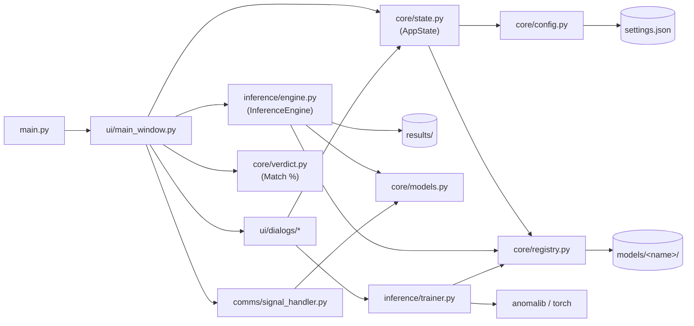

# Inspection Flow & Project Map

For explaining the app to the team. Two parts:
1. **What happens** when you *Upload Image* and click *Run Inspection* (flowchart).
2. **Where the code lives** — every folder/file, what it does, how they connect.

> The Mermaid diagrams render in VS Code (with the Markdown Preview Mermaid
> extension) and on GitHub. A plain-text version follows each diagram for any
> viewer that can't render Mermaid.

---

## 1. Upload Image → Run Inspection (what happens)



### Plain-text version

**Upload Image**
1. Open file picker → if nothing chosen, stop.
2. Show the image in the **Camera Capture** panel and store its path as `current_image`.
3. Status bar: `Loaded image: <name>`.

**Run Inspection** (same path whether clicked manually or fired by a PLC trigger)
1. **Guard** — no image loaded? → warn and stop. Models not ready? → warn and stop.
2. Status `Classifying image…`, clear the old result.
3. **Classify** (in `InferenceEngine`):
   - Preprocess the image (256×256 + normalize).
   - For **every** model in the registry: get it from the **LRU cache** (reuse if in RAM, else load `weights.pt` from disk and evict the least-recently-used), then run it → a raw anomaly score + a heatmap.
   - **Winner = the model with the lowest score** (best fit). Compute confidence, save the winner's heatmap to `results/`.
4. If it failed → status ERROR, stop.
5. Fill the **All-Models grid** (Match % via softmax, winner highlighted) and the **Result panel**; show the heatmap.
6. Status `Recognized: modelX (NN%)`.
7. Look up the winner's **model data** (diameter/height):
   - none found → warn, and **don't** send to the PLC;
   - found → send the **13-byte frame** (name + diameter + height) out the serial port.

> Recognition-only: there is no OK/NG here — the app tells you *which* model it is.

---

## 2. Project map — folders, files, what they do

```
wheel_inspection_py/
├── main.py                     # Entry point: starts Qt, opens MainWindow
├── settings.json               # Auto-generated: Modbus + app settings
├── requirements.txt            # Python dependencies
├── README_PYTHON_PORT.md       # The original spec this app is built from
│
├── Assets/                     # REFERENCE material (not run by the app)
│   ├── MainWindow.xaml         #   original WPF layout (visual reference)
│   ├── signal_handler1.py      #   original serial handler (ported to comms/)
│   └── Taurus_logo.PNG         #   logo shown in the title bar
│
├── models/                     # THE MODEL REGISTRY (one folder per model)
│   ├── model1/
│   │   ├── weights.pt          #   the trained checkpoint (~39 MB)
│   │   └── meta.json           #   {name, diameter, height, created}
│   ├── model2/ …               #   … up to 100 models
│
├── results/                    # Auto-generated heatmap overlays from inspections
│
├── docs/                       # Documentation for the team
│   ├── model_storage_design.md #   storage + scaling design
│   └── inspection_flow.md      #   this file
│
└── app/                        # THE APPLICATION CODE (grouped by aspect)
    ├── ui/                     # Everything the user sees
    │   ├── theme.py            #   colors + button/card styles (the palette)
    │   ├── widgets.py          #   reusable pieces (Card, ImageArea, headers)
    │   ├── main_window.py      #   the main screen + wires everything together
    │   └── dialogs/            #   secondary windows
    │       ├── model_data.py       #     edit model dimensions
    │       ├── model_data_view.py  #     read-only list of models
    │       ├── modbus_settings.py  #     edit serial/Modbus settings
    │       └── train.py            #     Train-new-model window
    │
    ├── core/                   # Domain logic + data (no UI, no heavy ML)
    │   ├── models.py           #   data classes: ModelData, ModbusSettings,
    │   │                       #     AppSettings, ClassificationResult
    │   ├── state.py            #   AppState: single source of truth + signals
    │   ├── config.py           #   read/write settings.json
    │   ├── registry.py         #   read/write the models/ folders (Plan B)
    │   └── verdict.py          #   Match % (softmax) recognition math
    │
    ├── inference/              # The machine-learning side
    │   ├── engine.py           #   InferenceEngine: LRU cache + classify()
    │   └── trainer.py          #   TrainThread: fit a new Patchcore model
    │
    └── comms/                  # Hardware communication
        └── signal_handler.py   #   serial trigger detection + 13-byte PLC frame
```

### The four layers (why the grouping)

| Folder | Responsibility | Depends on |
| --- | --- | --- |
| **ui/** | screens, buttons, dialogs — presentation only | core, inference, comms |
| **core/** | data shapes, state, persistence, recognition math | (nothing app-specific) |
| **inference/** | load models, classify images, train new models | core |
| **comms/** | talk to the PLC over serial | core |

Rule of thumb: **ui talks to everything; core talks to nothing above it.** That's
why swapping storage (registry.py) or the ML engine doesn't ripple into the UI.

---

## 3. How the pieces connect



### Reading the diagram

- **`main.py`** just launches **`main_window.py`**, which owns the three services:
  **AppState**, **InferenceEngine**, **SignalHandler**.
- **AppState** is the single source of truth. It reads **models** through
  `registry.py` (the `models/` folders) and **settings** through `config.py`
  (`settings.json`). When something changes it emits a Qt signal
  (`models_changed` / `settings_changed`) and the UI reacts.
- **InferenceEngine** asks `registry.py` where each model's `weights.pt` is,
  loads them through its LRU cache, classifies, and writes heatmaps to
  `results/`. It returns a `ClassificationResult` (defined in `core/models.py`).
- **Dialogs** edit state (model dims, settings) or launch **TrainThread**.
  Training writes a new model folder via `registry.py`; AppState fires
  `models_changed`, and the engine picks the new model up on the next inspection.
- **SignalHandler** watches the serial port; on a PLC trigger it emits a Qt
  signal that runs the *same* inspection path as the Run Inspection button, then
  sends the 13-byte measurement frame back.

### The one connection to remember
```
Run Inspection ─▶ InferenceEngine.classify ─▶ registry (models/*/weights.pt)
                                           └▶ ClassificationResult ─▶ UI panels
                                                                    └▶ SignalHandler ─▶ PLC
```
